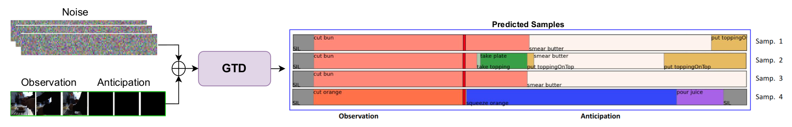
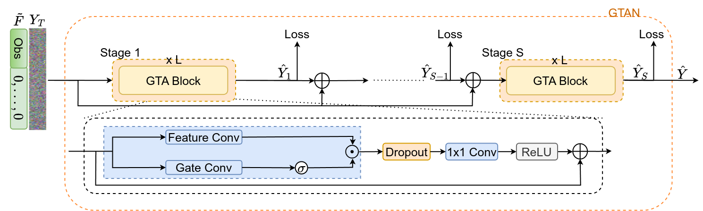

# [ECCV 2024] Gated Temporal Diffusion for Stochastic Long-Term Dense Anticiption

Gated Temporal Diffusion is an approach for stochastic long-term dense action anticipation, 
that models uncertainty in the observed and future frames jointly while preserving distinction between these two intrinsically different
parts using gating.

Here is the overview of our proposed model:
<p align="center">

</p>
<p align="center">

</p>


## Citation
If you find this code or our model useful, please cite our [paper](https://arxiv.org/abs/2407.11954):
```latex
@inproceedings{gtda2024zatsarynna,
    author    = {Olga Zatsarynna and Emad Bahrami and Yazan Abu Farha and Gianpiero Francesca and Juergen Gall},
    title     = {Gated Temporal Diffusion for Stochastic Long-Term Dense Anticipation},
    booktitle={European Conference on Computer Vision},
    year={2024},
}
```

## Installation
To create the [conda](https://docs.conda.io/en/latest/) environment run the following command:
```bash
conda env create --name gtda --file docker/env.yml
source activate gtda
```

## Datasets

### Breakfast
The features and annotations of the Breakfast dataset can be downloaded from 
[link 1](https://mega.nz/#!O6wXlSTS!wcEoDT4Ctq5HRq_hV-aWeVF1_JB3cacQBQqOLjCIbc8) 
or 
[link 2](https://zenodo.org/record/3625992#.Xiv9jGhKhPY).


### Assembly101
Follow the instructions at [Assembly101-Download-Scripts](https://github.com/assembly-101/assembly101-download-scripts) to download the TSM features.
We converted the `.lmdb` features to `numpy` for faster loading.
The  `coarse-annotations` can be downloaded from [assembly101-annotations](https://drive.google.com/drive/folders/1QoT-hIiKUrSHMxYBKHvWpW9Z9aCznJB7). 


## Stochastic Models

### 1. Training and Evaluation
To train the **stochastic** anticipation model, run:
```bash
bash scripts/prob/train_<dataset>_prob.sh
```

To evaluate the **stochastic** anticipation model, run:
```bash
bash scripts/prob/predict_<dataset>_prob.sh
```

This will show the evaluation results of the final model, as well as save final predictions
into the ```./diff_results``` directory. 
With the final results saved, you can run the **stochastic** evaluation faster using the following script:
```bash
bash scripts/prob/predict_precomputed_<dataset>_prob.sh
```

Make sure to update the paths (features and annotations) in the above scripts to match your system.
For changing the training and evaluation splits (for Breakfast dataset), 
as well as values of other hyper-parameters, modify the scripts accordingly.


### 2. Pretrained Stochastic Models
Coming soon!


## Deterministic Models

### 1. Training and Evaluation
To train the **determinstic** anticipation model, run the corresponding script:
```bash
bash scripts/determ/train_<dataset>_determ.sh
```

To evaluate the **deterministic** anticipation model, run the corresponding script:
```bash
bash scripts/determ/predict_<dataset>_determ.sh
```

### 2. Pretrained Deterministic Models
Coming soon!


## Acknowledgement
In our code we made use of the following repositories: [PDPP](https://github.com/MCG-NJU/PDPP), [MS-TCN](https://github.com/yabufarha/ms-tcn) and [LTC](https://github.com/LTContext/LTContext). We sincerely thank the authors for their codebases!

## License
<a rel="license" href="http://creativecommons.org/licenses/by-nc/4.0/"></a><br />This work is licensed under a <a rel="license" href="http://creativecommons.org/licenses/by-nc/4.0/">Creative Commons Attribution-NonCommercial 4.0 International License</a>.


